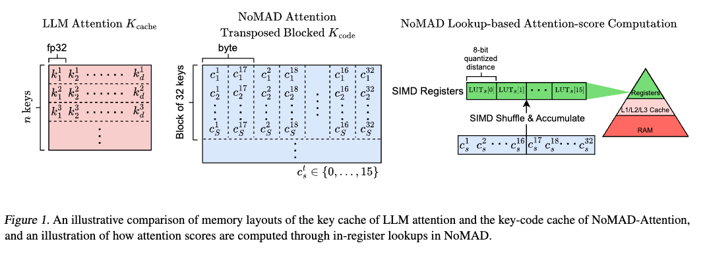
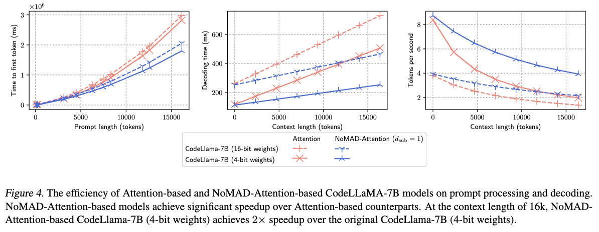

# NoMAD-Attention: Enhancing LLM Inference Efficiency on CPUs

[[Paper]](https://arxiv.org/abs/2403.01273)


NoMAD-Attention introduces an innovative attention algorithm designed to drastically improve the efficiency of Large Language Model (LLM) inference on CPUs, leveraging unique computational methods to accelerate processing speeds without compromising model quality.

## Approach

NoMAD-Attention revolutionizes LLM inference by eliminating the need for traditional Multiply-add (MAD) operations, utilizing efficient lookups and in-register shuffles—a capability uniquely suited to CPUs. This approach significantly reduces computational overhead, enabling faster inference times for CPU-based LLMs while maintaining compatibility with pre-trained attention-based models.

By sidestepping MAD operations, NoMAD-Attention _doubles_ the processing speed of a 4-bit quantized LLaMA-7B model for a 16k context length, ensuring the model's original quality is preserved.



**Important Notice**: Currently, the repository offers executable binaries for NoMAD-Attention as the source code undergoes a patent application process. We appreciate your understanding and patience.

## Getting Started

### Prerequisites

Ensure your system meets these requirements:
- Linux OS
- CPU with AVX2 support. Check with `lscpu | grep "avx2"`.
- OpenBLAS installed. For Ubuntu: `sudo apt-get install libopenblas-dev`.

### Installation

Before you begin, ensure that you are in the `nomad-dist` directory (the parent directory). All subsequent commands should be run from this directory.

1. **Install Dependencies**: Install the necessary packages by running the following command:
```bash
pip install -r requirements.txt
```

2. **Download Models**: Download the models CodeLLaMA-7B, LLaMA-2-7B, and StableLM-3B-4E1T by running the following commands:
    - _Note_: To download LLaMA-2, you need to obtain [an API key](https://llama.meta.com/llama-downloads) from Meta first.
```bash
bash models/download_codellama.sh
bash models/download_stablelm.sh

# Acquire API Key from Meta for LLaMA-2 before running the following command
bash models/download_llama2.sh
```

3. **Acquire Datasets**: Download the WikiText-2 and PTB datasets for testing by running the following command:
```bash
python data/download.py
```

### Quick Start

To quickly see NoMAD-Attention in action with CodeLLaMA-7B, navigate to the `models` directory, download the model, and execute it with NoMAD-Attention. Detailed commands for running the model and comparing performance with traditional attention methods are listed below.

1. **Execute CodeLLaMA-7B with NoMAD-Attention**
    Generate 16384 tokens with CodeLLaMA-7B using NoMAD-Attention.
    ```bash
    # Run the main application with the CodeLLaMA-7B model, using NoMAD-Attention, to generate 16384 tokens.
    # The decoding latency for each token is written to the log file codellama_nomad.log.
    # Errors and logs are redirected to codellama_nomad.log
    ./app/bin/main -m models/codellama-7b.Q4_0.gguf -n 16384 -pi assets/codellama-7b-dsub1 2> codellama_nomad.log
    ```
    - Parameters:
        - `-m` specifies the model path
        - `-n` specifies the number of tokens to generate
        - `-pi` specifies the path to the model's parameters

2. **Compare Performance**
    To compare the performance with the original dot-product attention, run the following command:
    ```bash
    # Run the main application with the CodeLLaMA-7B model, using the original dot-product attention, to generate 16384 tokens.
    # Errors and logs are redirected to codellama_attn.log
    ./app/bin/main -m models/codellama-7b.Q4_0.gguf -n 16384 2> codellama_attn.log
    ```
    - Parameters:
        - `-m` specifies the model path
        - `-n` specifies the number of tokens to generate

## Advanced Usage

### How to Adapt Your LLM to NoMAD-Attention?

NoMAD-Attention can be adapted to your LLM without retraining. You will need to generate new codebooks by saving attention key embeddings from your model, then perform k-means clustering to learn the codebooks. Step-by-step instructions for this process are detailed, including commands for saving attention keys and learning codebooks.

1. **Perform Model Inference on a Learning Corpus**
    - Begin by running your model on a learning corpus to save its attention key embeddings. This corpus does not need to be large; the objective is to ensure the model captures the necessary attention patterns.
    - Before running the command, create a directory to save the attention key embeddings. Create a directory named `codellama-7b-wikitext2-valid-keys` in the `assets` directory.

        ```bash
        # Create a directory to save the attention key embeddings
        mkdir -p assets/codellama-7b-wikitext2-valid-keys
        ```
    - Example command for saving attention keys for `codellama-7b` on `WikiText-2` validation set:

        ```bash
        # Runs perplexity on the validation set of WikiText-2 using the model codellama-7b.Q4_0.gguf
        # Then saves the attention key embeddings to the directory assets/codellama-7b-wikitext2-valid-keys (context length 512)
        ./app/bin/perplexity -m models/codellama-7b.Q4_0.gguf -c 512 -f data/wikitext-2-raw/wiki.valid.raw -psi assets/codellama-7b-wikitext2-valid-keys
        ```
    - Parameters:
        - `-m` specifies the model path
        - `-c` the context length
        - `-f` the text file containing the learning corpus
        - `-psi` the directory to save the attention key embeddings

2. **Learn Codebooks via k-means Clustering**
    - After saving the attention keys, perform k-means clustering on these embeddings to learn the codebooks.
    - Use this command to generate codebooks from the saved attention keys:

        ```bash
        # this command will dynamically determine the vector dimensions needed
        # if you already know the dimensions, you can specify them with the --dim flag
        python learn_codebooks.py --paths assets/codellama-7b-wikitext2-valid-keys --save_path assets/codellama-7b-wikitext2-valid-codebooks --range 0 1024 --d_sub 1 --niter 100 --overwrite
        ```

    - Parameters:
        - `--paths` specifies the paths to the saved attention keys.
        - `--save_path` specifies the directory to save the learned codebooks.
        - `--range` specifies the range of attention layers and heads. The range is calculated as (0, num_of_layers * num_of_attn_heads). For instance, CodeLLaMA-7B has 32 layers and 32 attention heads, hence the range is (0, 1024).
        - `--d_sub` specifies the dimension in each sub-quantizer. A value of 1 preserves model quality well.
        - `--niter` specifies the number of iterations for k-means.
        - `--overwrite` overwrites the existing .index files if they exist.
            - _Note_: if the `--overwrite` flag is not set, but the `--save_path` directory already exists, the command will fail and the error is logged in the generated .log file.

3. **Test Your Model with NoMAD-Attention**
    - Once the codebooks are ready, you can test your model with NoMAD-Attention.
    - For instance, to generate text with `codellama-7b` using the new codebooks:

        ```bash
        # Runs the main application with the CodeLLaMA-7B model, using the newly learned codebooks for NoMAD-Attention, to generate 1024 tokens.
        # Errors and logs are discarded.
        ./app/bin/main -m models/codellama-7b.Q4_0.gguf -n 1024 -pi assets/codellama-7b-wikitext2-valid-codebooks -p "What does the const keyword mean in C++? Answer: " 2> /dev/null
        ```
    - Parameters:
        - `-m` specifies the model path
        - `-n` specifies the number of tokens to generate
        - `-pi` specifies the path to the codebooks
        - `-p` sets the prompt for generation

### How to Reproduce NoMAD-Attention's Performance From Our Paper?

Our paper's perplexity results can be reproduced using the following commands for the StableLM-3B-4E1T (q8_0 quantized) model:

1. **With NoMAD-Attention ($d_\mathrm{sub}=1$)**: Evaluate on `WikiText-2` and `PTB` datasets using NoMAD-Attention.
```bash
# Runs perplexity on the test set of WikiText-2 using the quantized model stablelm-3b-4e1t.Q8_0.gguf with NoMAD-Attention
./app/bin/perplexity -m models/stablelm-3b-4e1t.Q8_0.gguf -pi assets/stablelm-3b-dsub1 -f data/wikitext-2-raw/wiki.test.raw -c 512

# Runs perplexity on the test set of PTB (Penn Tree Bank) using the quantized model stablelm-3b-4e1t.Q8_0.gguf with NoMAD-Attention
./app/bin/perplexity -m models/stablelm-3b-4e1t.Q8_0.gguf -pi assets/stablelm-3b-dsub1 -f data/ptb/test.txt -c 512
```

2. **With Original Attention**: Compare performance on the same datasets using original attention.
```bash
# Runs perplexity on the test set of WikiText-2 using the quantized model stablelm-3b-4e1t.Q8_0.gguf with the original attention
./app/bin/perplexity -m models/stablelm-3b-4e1t.Q8_0.gguf -f data/wikitext-2-raw/wiki.test.raw -c 512

# Runs perplexity on the test set of PTB (Penn Tree Bank) using the quantized model stablelm-3b-4e1t.Q8_0.gguf with the original attention
./app/bin/perplexity -m models/stablelm-3b-4e1t.Q8_0.gguf -f data/ptb/test.txt -c 512
```

As seen in the figure below, NoMAD-Attention-based models (blue) vs. their Attention-based counterparts (red) take roughly _**x2** less time to generate 16k tokens (decoding time)_ at _**x2** speed (tokens/second)_.


